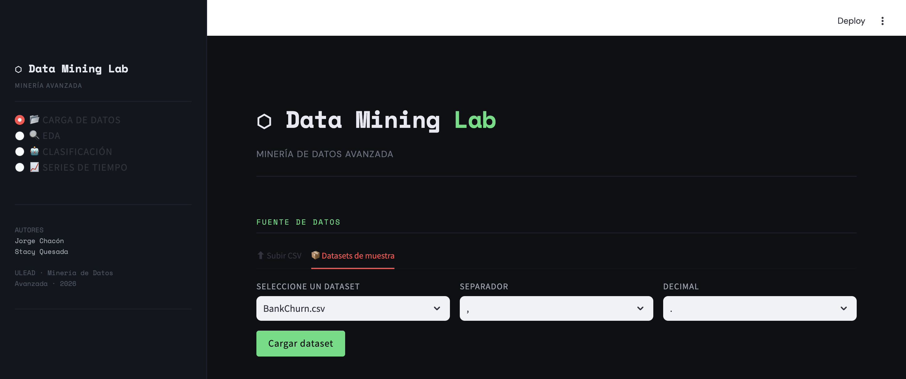
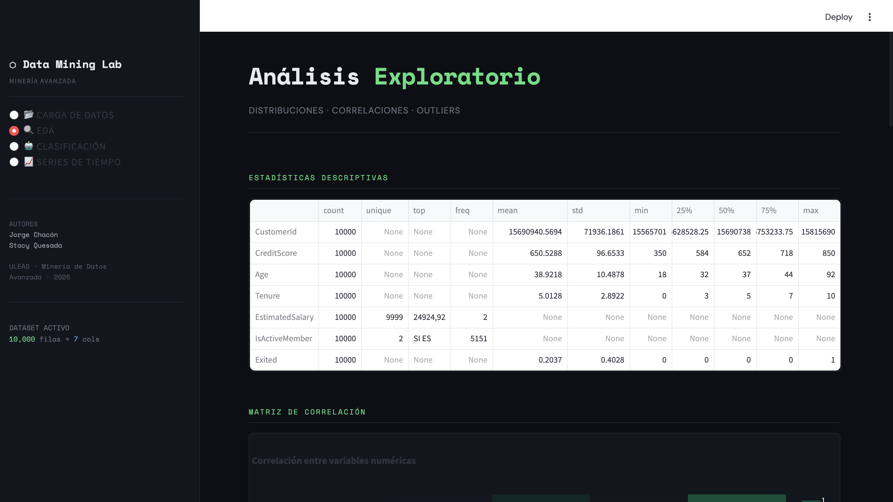
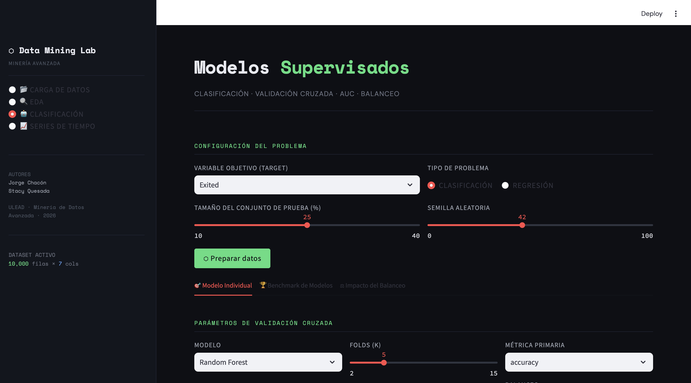
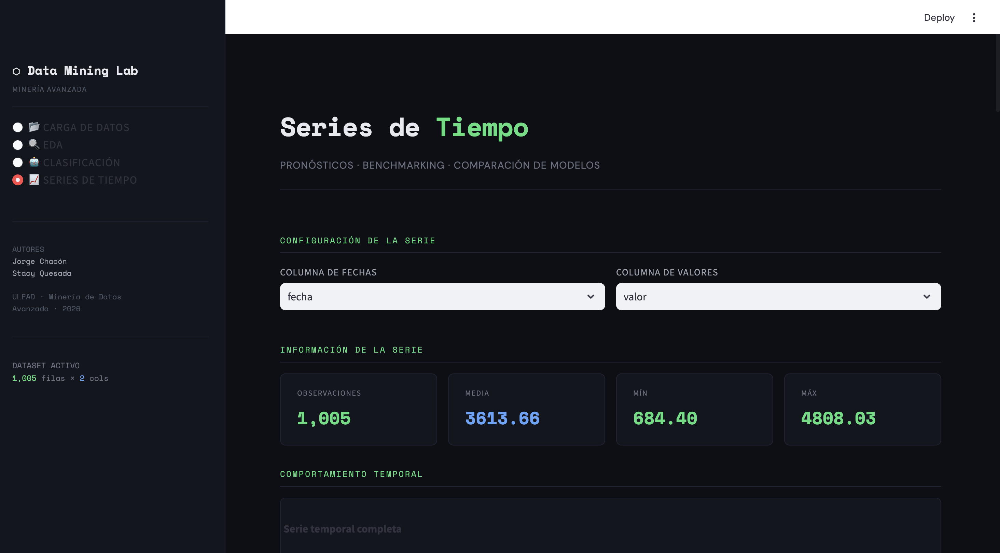

# Guía de uso — Data Mining Lab

---

## 1. Carga de datos

Punto de entrada de la app. Permite cargar un CSV local (con separador y decimal configurables) o seleccionar un dataset de muestra desde `data/`. Muestra métricas rápidas, vista previa y tipos de columnas.

---

## 2. EDA — Análisis Exploratorio

Descripción estadística completa del dataset. Incluye:

- **Estadísticas descriptivas** — count, mean, std, min, percentiles, max
- **Valores nulos** *(solo si los hay)* — barras por columna
- **Matriz de correlación** — heatmap de Pearson; valores cercanos a ±1 indican relación fuerte
- **Distribuciones** — histogramas por variable (detecte sesgo o bimodalidad)
- **Boxplots** — puntos fuera de los bigotes son outliers estadísticos
- **Scatter matrix** — dispersión entre pares de variables; coloreable por categoría

---

## 3. Clasificación

Entrena y evalúa modelos supervisados. Configure variable objetivo, test size (%) y semilla, luego presione **⬡ Preparar datos**.

### Tab 1 — Modelo Individual

Validación cruzada configurable (folds, método, métrica, balanceo). Las barras de error muestran estabilidad entre folds. Incluye curva ROC/AUC:

| AUC | Interpretación |
|---|---|
| 0.9 – 1.0 | Excelente |
| 0.7 – 0.9 | Bueno |
| 0.5 – 0.7 | Moderado |
| ~0.5 | Equivale a azar |

### Tab 2 — Benchmark de Modelos

Compara Random Forest, Decision Tree, KNN, XGBoost y AdaBoost con los mismos parámetros. Gráfico de radar + ranking por AUC.

### Tab 3 — Impacto del Balanceo

Útil cuando las clases están desbalanceadas. Técnicas disponibles: `none`, `oversample`, `undersample`, `smote`, `class_weight`. El gráfico Δ vs baseline muestra la ganancia/pérdida de cada técnica.

### Regresión *(target numérico)*

Benchmark automático con métricas RMSE, MAE y Error Relativo (%).

---

## 4. Series de Tiempo

Analiza y pronostica series temporales. Configure columna de fechas, columna de valores y test size.

Incluye visualización con media móvil, descomposición estacional (tendencia, estacionalidad, residuo) y gráficos ACF/PACF para configurar ARIMA.

### Modelos disponibles

| Modelo | Descripción |
|---|---|
| **Holt-Winters** | Suavizamiento exponencial triple; rápido |
| **Holt-Winters calibrado** | Optimiza parámetros α, β, γ automáticamente |
| **ARIMA (1,1,1)** | Buen punto de partida para series moderadas |
| **ARIMA calibrado** | Prueba múltiples (p,d,q) y elige el de menor MSE |

**Métricas:** RMSE, MAE, Correlación (CORR) y Error Relativo (RE). El tab **Comparar todos** ejecuta todos los modelos y los pone en tabla comparativa con gráficos de dispersión y pronósticos superpuestos.
